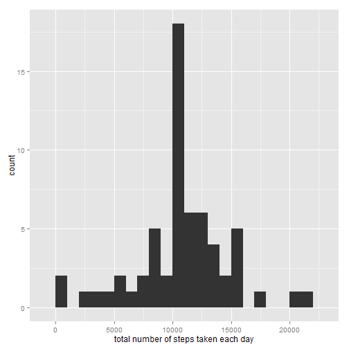

# Reproducible Research: Peer Assessment 1


```r
library(ggplot2)
```

```
## Need help? Try the ggplot2 mailing list: http://groups.google.com/group/ggplot2.
```

## Loading and preprocessing the data
##### 1. Load the data (i.e. read.csv())

```r
if(!file.exists('activity.csv')){
    unzip('activity.zip')
}
activityData <- read.csv('activity.csv')
```

-----

## What is mean total number of steps taken per day?
##### 1. Calculate the total number of steps taken per day

```r
stepsPerDay <- tapply(activityData$steps, activityData$date, FUN=sum, na.rm=TRUE)
```

#### 2. Make a histogram of the total number of steps taken each day

```r
qplot(stepsPerDay, binwidth=1000, xlab="Total Number Of Steps Taken Per Day")
```


#### 3. Calculate and report the mean and median of the total number of steps taken per day

```r
meanStepsPerDay <- mean(stepsPerDay, na.rm=TRUE)
medianStepsPerDay <- median(stepsPerDay, na.rm=TRUE)
```

* Mean: 9354.2295082
* Median:  10395

-----

## What is the average daily activity pattern?

```r
averages <- aggregate(x=list(steps=activityData$steps), by=list(interval=activityData$interval), FUN=mean, na.rm=TRUE)
```

#### 1. Make a time series plot

```r
ggplot(data=averages, aes(x=interval, y=steps)) + geom_line() +
    xlab("5-Minute Interval") + ylab("Average Number Of Steps Taken")
```


##### 2. Which 5-minute interval, on average across all the days in the dataset, contains the maximum number of steps
On average across all the days in the dataset, the 5-minute interval that contains the maximum number of steps?

```r
averages[which.max(averages$steps),]
```

```
##     interval    steps
## 104      835 206.1698
```

-----

## Imputing missing values
#### 1. Calculate and report the total number of missing values in the dataset

```r
missing <- is.na(activityData$steps)
# How many missing
table(missing)
```

```
## missing
## FALSE  TRUE 
## 15264  2304
```

#### 2. Devise a strategy for filling in all of the missing values in the dataset
All of the missing values are filled in with mean value for that 5-minute
interval.

##### 3. Create a new dataset that is equal to the original dataset but with the missing data filled in

```r
# Replace each missing value with the mean value of its 5-minute interval
fill.value <- function(steps, interval) {
    filled <- NA
    if (!is.na(steps))
        filled <- c(steps)
    else
        filled <- (averages[averages$interval==interval, "steps"])
    return(filled)
}
filledData <- activityData
filledData$steps <- mapply(fill.value, filledData$steps, filledData$interval)
```

##### 4. Make a histogram of the total number of steps taken each day

```r
stepsPerDay <- tapply(filledData$steps, filledData$date, FUN=sum)
qplot(stepsPerDay, binwidth=1000, xlab="total number of steps taken each day")
```



```r
mean(stepsPerDay)
```

```
## [1] 10766.19
```

```r
median(stepsPerDay)
```

```
## [1] 10766.19
```

Mean and median values are higher after imputing missing data. The reason is that in the original data, there are some days with `steps` values `NA` for any `interval`. The total number of steps taken in such days are set to 0s by default. However, after replacing missing `steps` values with the mean `steps` of associated `interval` value, these 0 values are removed from the histogram of total number of steps taken each day.

-----

## Are there differences in activity patterns between weekdays and weekends?
##### 1. Create a new factor variable in the dataset with two levels - "weekday" and "weekend" indicating whether a given date is a weekday or weekend day.

```r
weekday.or.weekend <- function(date) {
    day <- weekdays(date)
    if (day %in% c("Monday", "Tuesday", "Wednesday", "Thursday", "Friday"))
        return("weekday")
    else if (day %in% c("Saturday", "Sunday"))
        return("weekend")
    else
        stop("invalid date")
}
filledData$date <- as.Date(filledData$date)
filledData$day <- sapply(filledData$date, FUN=weekday.or.weekend)
```

##### 2. Make a panel plot containing a time series plot

```r
averages <- aggregate(steps ~ interval + day, data=filledData, mean)
ggplot(averages, aes(interval, steps)) + geom_line() + facet_grid(day ~ .) +
    xlab("5-Minute Interval") + ylab("Number Of Steps")
```


